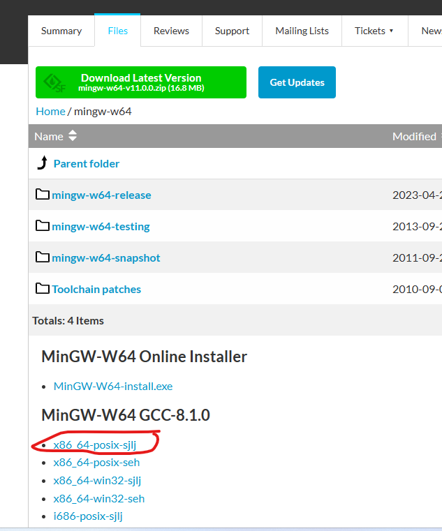
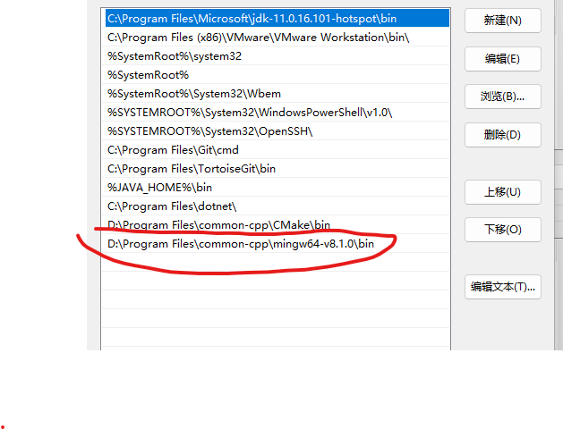

# Windows环境

## 准备MinGW编译环境

#### 下载MinGW编译器

[MinGW-w64 - for 32 and 64 bit Windows - Browse /mingw-w64 at SourceForge.net](https://sourceforge.net/projects/mingw-w64/files/mingw-w64/)



#### 设置环境变量



## 编译boost

```cmd
#第一步 
bootstrap.bat gcc

# 不要有空格
b2.exe install --prefix=D:\Documents\workspaces\cpp\boost\output\mgw8\boost_1_79_0 --build-type=complete toolset=gcc threading=multi --build-dir=D:\Documents\workspaces\cpp\boost\boost_1_79_0\build
```

